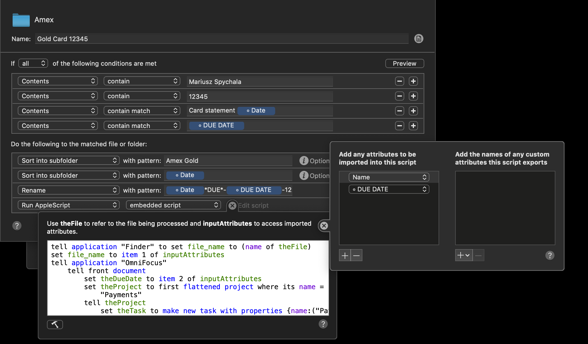
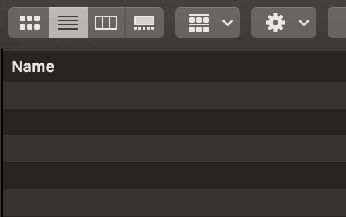

This is the first part in the ‘Managing Our Finance’ series.

When I was at Uni I discovered Evernote. It allowed me to be somewhat more productive, or at least less messy when it comes storing documents.


Going into adulthood I knew I wanted to adopt a paperless system when managing my life.   

While I moved away from Evernote there are still tools that I use to this date, that help me accomplish just that. 
One of those tools is Hazel. In a nutshell Hazel performs actions on folders based on the user defined set of rules. Moving, renaming, sorting etc. It’s super powerful. More on that later.
One thing I do need to mention is that it only runs on Mac. I don’t think there’s an equivalent piece of software for PCs. 

 
OmniFocus is my task manager of choice.
Over the years I switched from 2do to Todoist, then went back to 2do.
I also did experiment with Things 3 somewhere in between. 

There isn’t a perfect app for managing your todos. Everyone’s requirements would be different.   
I have to admit OmniFocus has a steep learning curve. For me the biggest advantage (over other apps) is its ability to filter tasks. 
This “just show me the tasks I can work on and ignore everything else” approach makes it one of the most powerful app to manage projects and tasks.


Back to Hazel.

There’s a reason why this post is the first one in the series.
Being able to file the bank statement in the right folder with the [only right method of naming files](https://guides.lib.purdue.edu/c.php?g=353013&p=2378293) seemed like an easy win when starting the paperless journey.
You want to quickly search across your statements to reference the transactions if for example you’re making a purchase protection claim.
Banks in most cases will only allow you to download statements for the last twelve months. Sure you can request those older statements or even ask an agent to find the matching transaction but that way you have all the answers at your fingerprint.

Every month (usually on a Saturday morning) I would log in to each of our financial institution’s portals and download corresponding statements.
Hazel is monitoring my Downloads folder and as soon as the file is downloaded, it recognises the file is a statement(in a .pdf format) based off the source url stored in the file property. It then files it under the correct folder like “Amex” which is being monitored against different set of conditions and as soon as the file is moved into that folder it performs different set of actions. 
So a file like `random-name.pdf` (not very helpful) becomes `2020-01*DUE*-27Jan-12345` containing all the important information: 
* Statement Year and Month 
* Payment’s due date
* The last 5digits from the long card number 

If you have multiple cards with the same card issuer(like we do with Amex) the file is sorted into a subfolder with a path like this:\
`Amex/Mariusz-Gold/2020/2020-01*DUE*-27Jan-12345.pdf`

Here's the full screen setup in Hazel:


Here’s the end result:


Magic. 

At this point it would be great to put that nicely formatted filename into a “good use”. 
The next step is a bit geeky.

I’ve mentioned already that Hazel can run actions. Like mini programs but with no code.
Well turns out Hazel can run an actual code and with some experimenting and googling I was able to put together an AppleScript that will create a “payment” task in my OmniFocus “Finance” project.

Here’s the actual script.

```applescript
tell application "Finder" to set file_name to (name of theFile)
set file_name to item 1 of inputAttributes
tell application "OmniFocus"
	tell front document
		set theDueDate to item 2 of inputAttributes
		set theProject to first flattened project where its name = "Payments"
		tell theProject
			set theTask to make new task with properties {name:("Pay " & file_name), due date:theDueDate}
			tell the note of theTask
				make new file attachment with properties {file name:theFile, embedded:true}
			end tell
		end tell
	end tell
end tell
```

Not only the script is parsing the payment due date but it would also attach the actual pdf file for referencing!

At one point we had 20+ credit cards. This workflow takes about 5mins to process all of them 💥


